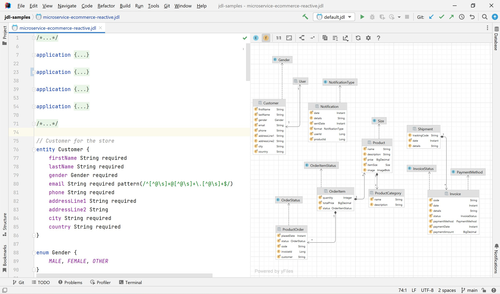

# jdl-intellij-plugin

The [JDL](https://www.jhipster.tech/jdl/intro) is a JHipster-specific domain language where you can describe all your 
applications, deployments, entities and their relationships in a single file (or more than one) with a user-friendly 
syntax.

This is the plugin for IntelliJ IDEA that helps editing and running JDL.

[Download IDE plugin](https://plugins.jetbrains.com/plugin/19697-jhipster-jdl).

### If you want to support the project

Follow author in Twitter: [@Yuriy Artamonov](https://twitter.com/Yuriy_Artamonov)

## How it looks

## Development

- Simply open project in IntelliJ IDEA 2022.3
- Make sure Plugin DevKit plugin enabled in IntelliJ IDEA
- Install Grammar-Kit plugin to edit .bnf and .flex
- Build and Run the plugin using `Run Plugin` run configuration